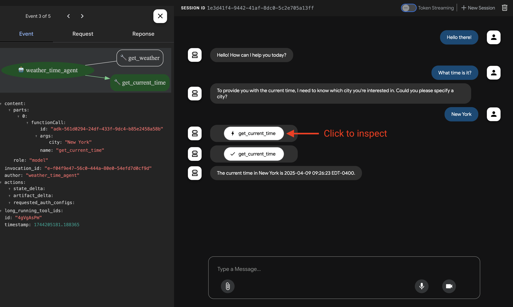

# 快速入门

本指南将带您完成安装Agent开发工具包(ADK)、配置一个具备多工具的基础智能体，并通过终端或基于浏览器的交互式开发界面在本地运行它的全过程。

<!--  -->

本指南假设您已具备本地IDE环境(VS Code/PyCharm等)和Python 3.9+运行环境。此方法完全在本地运行应用，推荐用于内部开发。

## 1. 环境配置与安装ADK {#venv-install}

创建并激活虚拟环境(推荐)：

```bash
# Create
python -m venv .venv
# Activate (each new terminal)
# macOS/Linux: source .venv/bin/activate
# Windows CMD: .venv\Scripts\activate.bat
# Windows PowerShell: .venv\Scripts\Activate.ps1
```

安装ADK：

```bash
pip install google-adk
```

## 2. 创建智能体项目 {#create-agent-project}

### 项目结构

需要创建以下项目结构：

```console
parent_folder/
    multi_tool_agent/
        __init__.py
        agent.py
        .env
```

创建文件夹 `multi_tool_agent`：

```bash
mkdir multi_tool_agent/
```

!!! info "Windows用户注意"

    在Windows环境下执行后续步骤时，建议通过文件资源管理器或IDE创建Python文件，因为以下命令(`mkdir`，`echo`)生成的文件可能包含空字节或编码错误。

### `__init__.py`

现在在文件夹中创建 `__init__.py` 文件：

```shell
echo "from . import agent" > multi_tool_agent/__init__.py
```

您的 `__init__.py` 现在应呈现如下结构：

```python title="multi_tool_agent/__init__.py"
--8<-- "examples/python/snippets/get-started/multi_tool_agent/__init__.py"
```

### `agent.py`

在同一文件夹创建 `agent.py` 文件：

```shell
touch multi_tool_agent/agent.py
```

将以下代码复制到 `agent.py`：

```python title="multi_tool_agent/agent.py"
--8<-- "examples/python/snippets/get-started/multi_tool_agent/agent.py"
```

### `.env`

在同一文件夹创建 `.env` 文件：

```shell
touch multi_tool_agent/.env
```

该文件的详细说明请参阅下一章节[模型配置](#set-up-the-model)。


## 3. 配置大模型 {#set-up-the-model}

智能体理解用户请求和生成响应的能力依托于大模型(LLM)。需要通过安全认证调用外部LLM服务，否则服务将拒绝请求导致功能失效。

=== "Gemini - Google AI Studio"
    1. 从[Google AI Studio](https://aistudio.google.com/apikey)获取API密钥
    2. 打开位于(`multi_tool_agent/`)的**`.env`**文件，粘贴以下代码：

        ```env title="multi_tool_agent/.env"
        GOOGLE_GENAI_USE_VERTEXAI=FALSE
        GOOGLE_API_KEY=在此粘贴实际API密钥
        ```

    3. 将 `GOOGLE_API_KEY` 替换为您的实际 `API KEY`

=== "Gemini - Google Cloud Vertex AI"
    1. 需具备[Google Cloud](https://cloud.google.com/?e=48754805&hl=en)账号和项目
        * 配置[Google Cloud项目](https://cloud.google.com/vertex-ai/generative-ai/docs/start/quickstarts/quickstart-multimodal#setup-gcp)
        * 安装[gcloud CLI](https://cloud.google.com/vertex-ai/generative-ai/docs/start/quickstarts/quickstart-multimodal#setup-local)
        * 在终端运行 `gcloud auth login` 完成认证
        * [启用Vertex AI API](https://console.cloud.google.com/flows/enableapi?apiid=aiplatform.googleapis.com)
    2. 打开位于(`multi_tool_agent/`)的**`.env`**文件，粘贴以下代码并更新项目ID和位置：

        ```env title="multi_tool_agent/.env"
        GOOGLE_GENAI_USE_VERTEXAI=TRUE
        GOOGLE_CLOUD_PROJECT=您的项目ID
        GOOGLE_CLOUD_LOCATION=区域
        ```

## 4. 运行智能体 {#run-your-agent}

在终端中导航至项目父目录(例如使用 `cd ..`)：

```console
parent_folder/      <-- navigate to this directory
    multi_tool_agent/
        __init__.py
        agent.py
        .env
```

可通过多种方式与智能体交互：

=== "开发界面(adk web)"
    运行以下命令启动**开发界面**：

    ```shell
    adk web
    ```

    **步骤1：** 在浏览器中打开提供的URL(通常为 `http://localhost:8000` 或 `http://127.0.0.1:8000`)

    **步骤2：** 在界面左上角下拉菜单中选择"multi_tool_agent"

    !!!note "故障排查"

        如果下拉菜单中未显示"multi_tool_agent"，请确认当前在项目父目录(即multi_tool_agent的上级目录)运行 `adk web`

    **步骤3：** 现在可通过文本框与智能体对话：

    

    **步骤4：** 点击操作可查看具体函数调用、响应和模型输出：

    

    **步骤5：** 还可启用麦克风进行语音交互：
    
    !!!note "语音/视频流支持的模型"
    
        使用ADK的语音/视频流功能需要支持Live API的Gemini模型。可通过以下文档查询**模型ID**：
        - [Google AI Studio: Gemini Live API](https://ai.google.dev/gemini-api/docs/models#live-api)
        - [Vertex AI: Gemini Live API](https://cloud.google.com/vertex-ai/generative-ai/docs/live-api)

        然后修改 `agent.py` 文件中 `root_agent` 的 `model` 字段，示例如下：
        
        ```py
        root_agent = Agent(
            name="weather_time_agent",
            model="替换为模型ID", #例如 gemini-2.0-flash-live-001
            ...
        ```

    

=== "终端(adk run)"

    运行以下命令与Google搜索智能体对话：

    ```
    adk run multi_tool_agent
    ```

    

    按Cmd/Ctrl+C退出

=== "API服务(adk api_server)"

    `adk api_server` 可快速创建本地FastAPI服务，便于部署前测试cURL请求：

    

    测试方法详见[测试文档](testing.md)

### 📝 可尝试的提示词示例

* 纽约天气如何？
* 纽约现在几点？
* 巴黎天气如何？
* 巴黎现在几点？

## 🎉 恭喜完成！

您已成功使用ADK创建并运行了第一个智能体！

---

## 🛣️ 后续步骤

* **教程学习**：了解如何为智能体添加记忆、会话和状态功能：[教程](tutorial.md)
* **高级配置**：深入探索[配置指南](installation.md)了解项目结构与接口配置
* **核心概念**：学习[智能体基础概念](../agents/index.md)